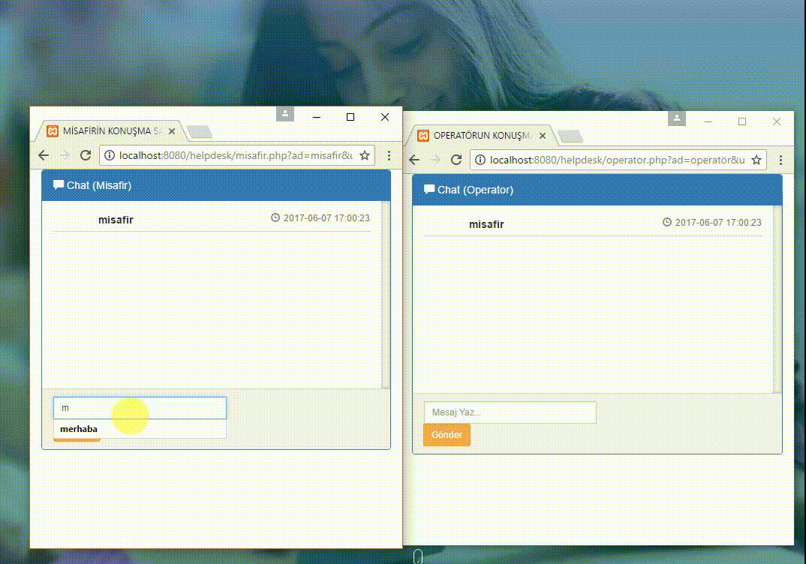

# jqueryCHATBOX
AJAX ile veritabanına son yazılan mesajı sayfayı yenilemeden chat kutusuna getiren php ve sql dosyaları bulunmaktadır. İki tarayıcı penceresi açıp birinde localhost/helpdesk/misafir.php  diğerinde localhost/helpdesk/operator.php çalıştırılmalıdır.

